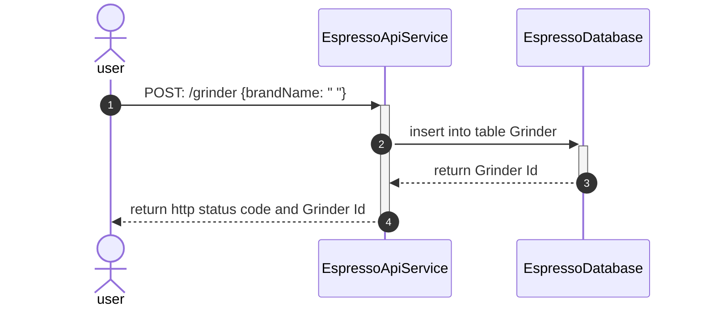
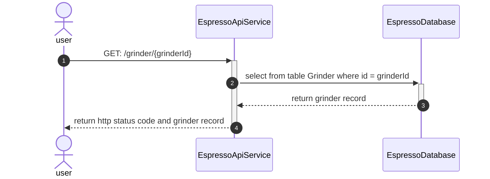
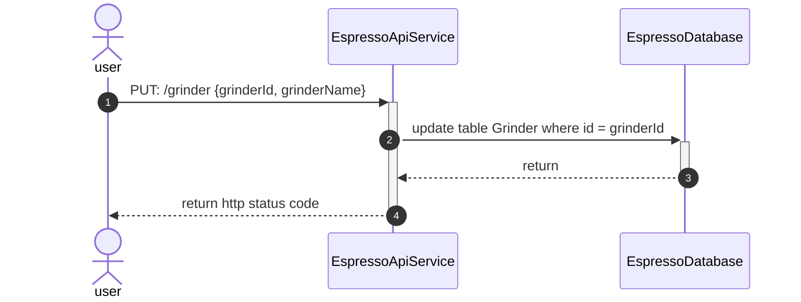
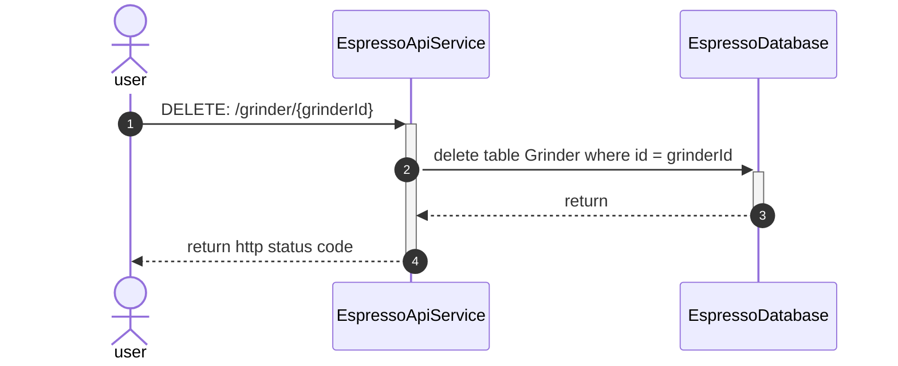

## Grinder Table CRUD Operations
### Create

```mermaid
sequenceDiagram
autonumber

    actor user
    participant api as EspressoApiService
    participant db as EspressoDatabase
    
    user->>+api: POST: /grinder {brandName: " "}
        api->>+db: insert into table Grinder
        db-->>-api: return Grinder Id
    api-->>-user: return http status code and Grinder Id
```
### Read

```mermaid
sequenceDiagram
autonumber

    actor user
    participant api as EspressoApiService
    participant db as EspressoDatabase
    
    user->>+api: GET: /grinder/{grinderId}
        api->>+db: select from table Grinder where id = grinderId
        db-->>-api: return grinder record
    api-->>-user: return http status code and grinder record
```
### Update

```mermaid
sequenceDiagram
autonumber

    actor user
    participant api as EspressoApiService
    participant db as EspressoDatabase
    
    user->>+api: PUT: /grinder {grinderId, grinderName}
        api->>+db: update table Grinder where id = grinderId
        db-->>-api: return
    api-->>-user: return http status code
```
### Delete

```mermaid
sequenceDiagram
autonumber

    actor user
    participant api as EspressoApiService
    participant db as EspressoDatabase
    
    user->>+api: DELETE: /grinder/{grinderId}
        api->>+db: delete table Grinder where id = grinderId
        db-->>-api: return
    api-->>-user: return http status code
```